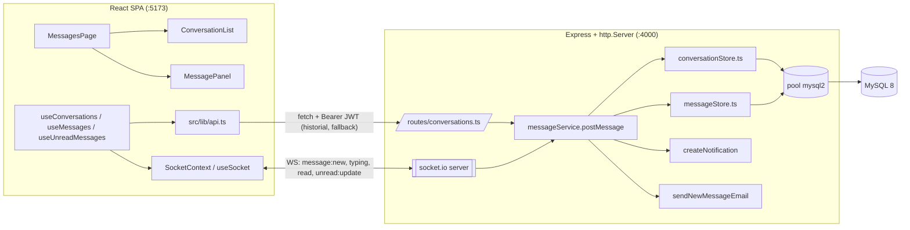
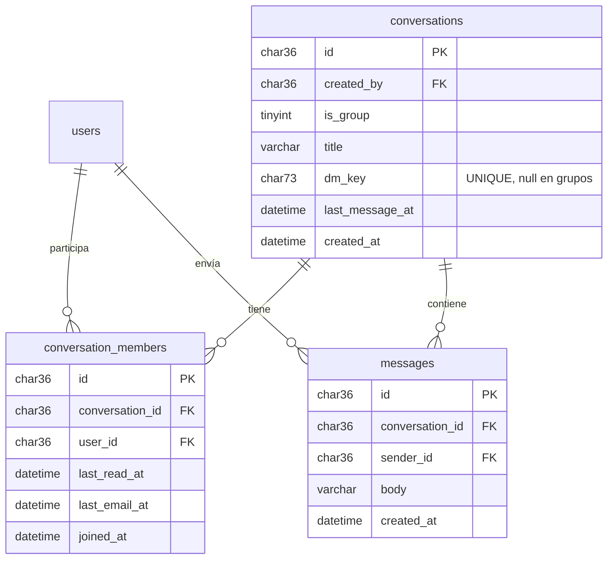
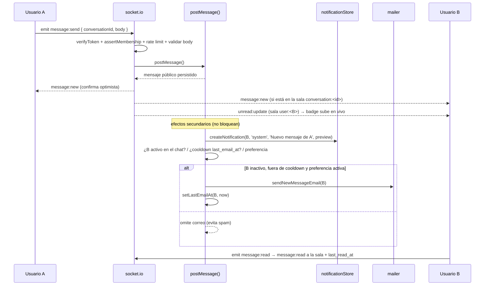

# Diseño — Mensajería directa en tiempo real

## Visión general

Módulo vertical aislado que añade mensajería directa 1:1 con entrega en tiempo real. Reutiliza la
infraestructura existente (JWT, notificaciones in-app, correo, cliente `fetch`) y respeta las
convenciones del proyecto: backend por capas (`routes/* → *Store.ts → pool mysql2`), `asyncRoute()`,
`requireAuth`, SQL parametrizado, IDs `CHAR(36)` con `randomUUID()`, mapeo `snake_case`↔`camelCase`
con `mapRow()`, `toPublicX()`, imports internos con extensión `.js` (NodeNext), y estilos Tailwind con
tema oscuro.

**WebSockets (socket.io) es el canal principal** de tiempo real; REST es la fuente de verdad para
historial paginado y el fallback de escritura. Ambos caminos de escritura comparten una única función
de servicio `postMessage()` para no duplicar validación ni efectos secundarios.

## Arquitectura



Principios de desacoplamiento:

- Toda la lógica nueva vive en archivos propios; los archivos compartidos solo reciben cambios
  aditivos (`index.ts`, `App.tsx`, `DashboardLayout.tsx`, y extracción de `verifyToken` en `auth.ts`).
- Autorización por membresía en un único punto (`assertMembership`), reutilizado por REST y WS.
- Los efectos secundarios (notificación + correo) nunca bloquean ni cancelan el envío del mensaje.

## Modelo de datos

Tres tablas nuevas en `server/src/schema.sql` (idempotentes, InnoDB, `utf8mb4`). **Ninguna tabla
existente se modifica.**



### Definición de tablas

- **`conversations`**: `id CHAR(36) PK`, `created_by CHAR(36)`, `is_group TINYINT DEFAULT 0`,
  `title VARCHAR(120) NULL`, `dm_key CHAR(73) NULL UNIQUE`, `last_message_at DATETIME NULL`,
  `created_at DATETIME DEFAULT CURRENT_TIMESTAMP`. FK `created_by → users(id) ON DELETE CASCADE`.
- **`conversation_members`**: `id CHAR(36) PK`, `conversation_id CHAR(36)`, `user_id CHAR(36)`,
  `last_read_at DATETIME NULL`, `last_email_at DATETIME NULL`,
  `joined_at DATETIME DEFAULT CURRENT_TIMESTAMP`. `UNIQUE (conversation_id, user_id)`,
  índice `(user_id)`. FKs `→ conversations(id)` y `→ users(id)` `ON DELETE CASCADE`.
- **`messages`**: `id CHAR(36) PK`, `conversation_id CHAR(36)`, `sender_id CHAR(36)`,
  `body VARCHAR(2000)`, `created_at DATETIME DEFAULT CURRENT_TIMESTAMP`.
  índice `(conversation_id, created_at DESC, id)`. FKs `ON DELETE CASCADE`.

### Justificación

- **`conversations` + `conversation_members`** (en lugar de columnas `user_a`/`user_b`): normaliza la
  relación y deja el modelo listo para grupos sin migración, con coste mínimo.
- **`dm_key CHAR(73)` UNIQUE** = `min(id) + ':' + max(id)` de los dos participantes. Garantiza una
  única conversación directa entre dos usuarios de forma atómica y evita duplicados por condiciones de
  carrera. `NULL` en grupos.
- **`last_read_at` / `last_email_at` en `conversation_members`**: los no leídos se calculan como
  `messages` con `created_at > last_read_at` y `sender_id != user_id` (O(1) de estado por miembro, sin
  tabla de recibos). `last_email_at` habilita el throttling de correo sin tocar la tabla `users`.
- **`last_message_at` denormalizado**: ordena la bandeja con un índice, sin subconsultas costosas.
- **Paginación keyset** por `(created_at, id)` en vez de `OFFSET`, para rendimiento estable.

## Backend

### Archivos nuevos

- `server/src/conversationStore.ts` — `ConversationRow`/`mapRow`, `findOrCreateDirectConversation()`,
  `listConversationsForUser()`, `findConversationById()`, `isMember()`, `touchLastMessage()`.
- `server/src/messageStore.ts` — `createMessage()`, `listMessages(conversationId, cursor, limit)`,
  `countUnreadForUser()`, `countTotalUnread()`, `markRead()`, `getMembership()`, `setLastEmailAt()`.
- `server/src/messageService.ts` — **`postMessage({ conversationId, senderId, body })`**: valida,
  persiste (`createMessage` + `touchLastMessage`), calcula receptores, dispara notificación y correo
  (con throttling), y devuelve el mensaje público listo para difundir. Punto único de escritura.
- `server/src/routes/conversations.ts` — router REST montado como `/api/conversations`.
- `server/src/realtime.ts` — capa socket.io: `initRealtime(httpServer)`, auth de handshake, salas y
  manejadores de eventos; expone helpers de emisión (`emitMessage`, `emitUnread`, `emitRead`).

### Archivos compartidos con cambios aditivos

- `server/src/auth.ts` — extraer `export function verifyToken(token): AuthPayload | null` reutilizado
  por `requireAuth` y por el handshake del socket (misma verificación JWT).
- `server/src/index.ts` — crear `const httpServer = http.createServer(app)`, llamar
  `initRealtime(httpServer)` y usar `httpServer.listen(PORT, ...)` en lugar de `app.listen(...)`.
  Montar el router: `app.use('/api/conversations', conversationRoutes)`.
- `server/src/types.ts` — interfaces `Conversation`, `ConversationSummary`, `Message` +
  `toPublicMessage()` / `toPublicConversation()` (nunca exponen columnas internas).
- `server/src/emailTemplates.ts` — `renderNewMessageEmail(data)` con el estilo de las demás plantillas.
- `server/src/mailer.ts` — `sendNewMessageEmail(to, data)` reutilizando `dispatch()`.

### Capa WebSocket (`realtime.ts`)

- **Handshake**: el cliente envía el JWT en `auth.token`; el servidor lo valida con `verifyToken()`.
  Sin token válido → conexión rechazada. CORS alineado a `CLIENT_URL`.
- **Salas**: al conectar, el socket se une a `user:<userId>` (badges y avisos entre conversaciones); al
  abrir un hilo se une a `conversation:<id>` tras validar membresía con `assertMembership`.
- **Eventos servidor→cliente**: `message:new`, `message:read`, `typing`, `conversation:updated`,
  `unread:update`.
- **Eventos cliente→servidor**: `conversation:join` / `conversation:leave`, `message:send`,
  `message:read`, `typing`.
- `message:send` reutiliza `postMessage()` y luego difunde `message:new` a `conversation:<id>` y
  `unread:update` a `user:<receptorId>`. Rate limit también aplicado en el handler de socket.

> **Nota de implementación:** El ACK devuelto por el servidor debe incluir `ok: true` para que el
> cliente sepa que el socket tuvo éxito y no dispare el fallback REST: `ack({ ok: true, message })`.

### Endpoints REST

| Método | Ruta                                                       | Descripción                                                      | Autorización                  |
| ------ | ---------------------------------------------------------- | ---------------------------------------------------------------- | ----------------------------- |
| POST   | `/api/conversations`                                       | Crear u obtener DM `{ recipientId }` (idempotente `dm_key`)      | Autenticado; no consigo mismo |
| GET    | `/api/conversations`                                       | Bandeja: último mensaje + no leídos, orden por `last_message_at` | Solo conversaciones propias   |
| GET    | `/api/conversations/:id/messages?before=<cursor>&limit=30` | Historial keyset                                                 | Debe ser miembro              |
| POST   | `/api/conversations/:id/messages`                          | Enviar `{ body }` (fallback sin socket)                          | Debe ser miembro              |
| POST   | `/api/conversations/:id/read`                              | Marca leído (`last_read_at`)                                     | Debe ser miembro              |
| GET    | `/api/conversations/unread-count`                          | Total de no leídos (arranque del badge)                          | Del usuario                   |
| GET    | `/api/conversations/contacts?q=`                           | Búsqueda mínima de usuarios (`toPublicUser` reducido)            | Autenticado                   |

Todos con `requireAuth`, `asyncRoute`, validación en servidor (mensajes en español) y `assertMembership`
donde aplique. Rate limit con `express-rate-limit`: envío ~60 msgs/5min por usuario; creación de
conversaciones ~30/hora.

## Frontend

### Estructura de carpetas

```
src/
  pages/
    MessagesPage.tsx            # envuelve DashboardLayout; layout de 2 columnas
  components/
    messages/
      ConversationList.tsx      # columna izquierda (lista + búsqueda)
      ConversationListItem.tsx  # avatar, nombre, preview, hora, badge no leídos
      ConversationSearch.tsx    # buscador de conversaciones/contactos
      NewConversationModal.tsx  # buscar usuario e iniciar chat
      MessagePanel.tsx          # columna derecha (header + lista + composer)
      MessageList.tsx           # scroll invertido + "cargar más" (paginación)
      MessageBubble.tsx         # burbuja emisor/receptor
      MessageComposer.tsx       # textarea + enviar (Enter / Shift+Enter)
      TypingIndicator.tsx       # "escribiendo…" (WS)
      MessagesEmptyState.tsx    # estado vacío (sin selección / sin conversaciones)
  context/
    SocketContext.tsx           # conexión socket.io única autenticada con JWT
  hooks/
    useSocket.ts                # acceso al socket + estado de conexión
    useConversations.ts         # bandeja; se actualiza por conversation:updated (polling = fallback)
    useMessages.ts              # historial REST + tiempo real (message:new/read/typing) + markRead
    useSendMessage.ts           # envío por WS con fallback REST (sin capa optimista)
    useUnreadMessages.ts        # contador global vía unread:update (polling = fallback)
```

### Comportamiento

- `SocketContext` abre una conexión autenticada al montar el dashboard; reconexión automática; expone
  `connected`.
- Entrega instantánea: `useMessages` pinta `message:new`; `useConversations` reordena por
  `conversation:updated`; `useUnreadMessages` actualiza el badge por `unread:update`.
- "Escribiendo…" y lectura en vivo vía eventos `typing` y `message:read`.
- **Degradación elegante**: si el socket no conecta, los hooks caen a polling REST (30s, patrón de la
  campana existente) y a envío por `POST`, sin romper la UI.
- Estados de **carga** (skeletons), **error** (banner con reintento) y **vacío** cubiertos.
- Estilos: tokens Tailwind existentes (`bg-ink-*`, `text-accent-*`, `border-white/10`,
  `bg-white/[0.03]`, `rounded-2xl`), iconos `lucide-react`, animaciones `framer-motion`.

### Cliente API (`src/lib/api.ts`)

Se añaden tipos (`Conversation`, `ConversationSummary`, `Message`) y funciones (`createConversation`,
`listConversations`, `listMessages`, `sendMessage` (fallback), `markConversationRead`,
`getUnreadMessageCount`, `searchContacts`), siguiendo el patrón del cliente `fetch` único con Bearer
JWT desde `localStorage['talentflow_token']`. El socket vive en `SocketContext`, no en el cliente REST.

> **Nota de implementación:** Las respuestas del backend están envueltas en objetos (`{ conversation }`,
> `{ conversations }`, `{ unreadCount }`, `{ contacts }`). Las funciones en `api.ts` deben desempaquetar
> estos campos antes de devolver el valor al hook consumidor.

### Integración con el dashboard

- `src/App.tsx`: añadir ruta protegida `/dashboard/mensajes` → `MessagesPage`, **antes** del catch
  `/dashboard/*`. Cambio de una entrada, aditivo.
- `src/components/dashboard/DashboardLayout.tsx`: añadir badge de no leídos al ítem "Mensajes" del
  sidebar usando `useUnreadMessages()`. El ítem ya existe en `getNavItems()`.

Nuevas dependencias: `socket.io` (server) y `socket.io-client` (front), fijadas a versión exacta.

## Flujo completo



## Manejo de errores

- Backend: validación en servidor con mensajes en español; `asyncRoute` captura rechazos; el
  middleware de errores central ya existente responde 500 controlado.
- WebSocket: eventos de error específicos al cliente (join no autorizado, rate limit); el front cae a
  REST/polling.
- Correo: los fallos se registran y nunca cancelan el envío del mensaje (patrón existente).
- Frontend: envío optimista con rollback si la persistencia falla; banners de error con reintento.

> **Nota de implementación:** El envío optimista fue retirado de `useSendMessage`/`MessagePanel`
> porque el `tempId` generado en cliente nunca coincidía con el ID real del servidor, lo que
> producía duplicados visuales permanentes. La latencia perceptible es despreciable gracias a la
> entrega por socket.

## Seguridad

- SQL 100% parametrizado; IDs `CHAR(36)` `randomUUID()`.
- Autorización por membresía en REST y WS (`assertMembership`), preparada para restringir por relación.
- Handshake WS autenticado con el mismo JWT; salas validadas por membresía; CORS a `CLIENT_URL`.
- `body` saneado (trim, longitud, no vacío); React escapa el render; la plantilla de correo escapa HTML.
- Rate limit en envío y creación de conversaciones.

## Estrategia de pruebas

- **Unit (stores)**: dedupe de DM (`dm_key`), paginación keyset, conteo de no leídos con `last_read_at`.
- **Integración (REST)**: crear/listar/enviar/leer/unread; 403 fuera de membresía; rate limit; validación.
- **WebSocket**: handshake válido/inválido; join no autorizado rechazado; broadcast a la sala correcta;
  `unread:update`.
- **Frontend (hooks/UI)**: estados carga/error/vacío; envío optimista; reordenado por eventos.
- **E2E manual**: chat entre dos navegadores; verificación de correos vía Ethereal (preview en consola).
- Si no hay runner configurado, se añade el estándar del ecosistema como primera tarea de pruebas.
